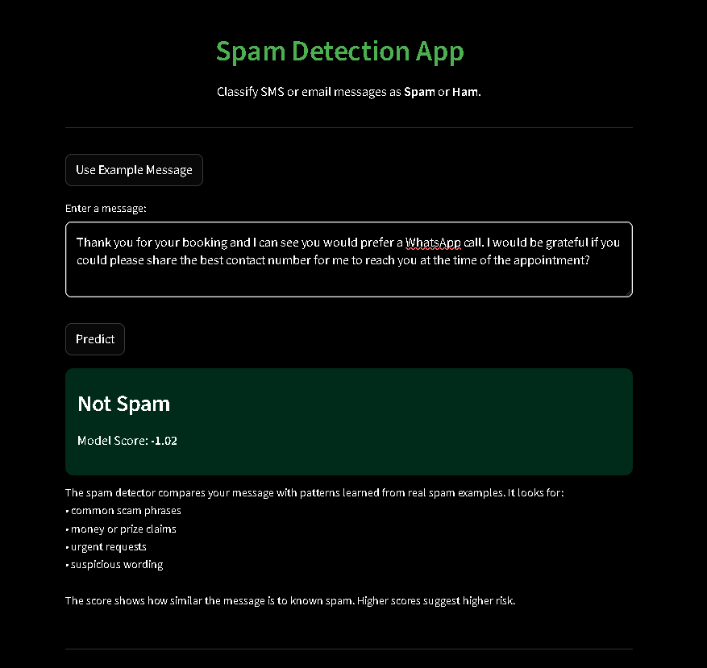
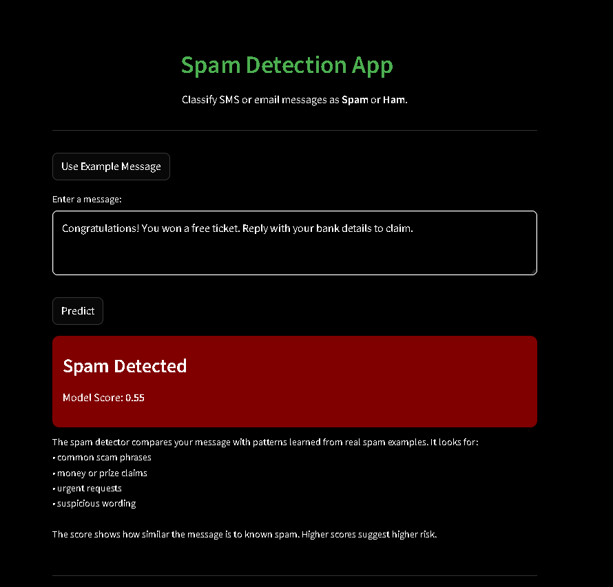

# **Spam Detection NLP System**
I developed this project to demonstrate a practical end-to-end NLP workflow for classifying SMS messages as spam or legitimate text. My aim was to show how a real machine-learning system is built: from raw data and preprocessing to model development, evaluation, and an interactive application. The solution includes a complete text-processing pipeline, TF-IDF feature engineering, two classical machine-learning classifiers, and a Streamlit interface for real-time predictions. I organised the project in a modular way so it remains clear, maintainable, and easy to extend.

## **Project Overview**
I used the SMS Spam Collection dataset as the basis for this work.
The modelling process is built around two approaches:

- Naive Bayes, used as a simple and reliable baseline
- Support Vector Machine (SVM), which became the final and best-performing model

Every message passes through my preprocessing pipeline (lowercasing, stopword removal, and lemmatization), is converted into TF-IDF features, and then classified by the trained model. To demonstrate the system clearly, I wrapped everything in a Streamlit interface where users can type a message or load an example and instantly receive a prediction.

### Streamlit App Home

### Spam Prediction Result

### Not Spam Prediction Result

## **Understanding the Model Score**
The number shown under each prediction is the model’s confidence score. It comes from the SVM classifier and reflects how strongly the model leans toward either spam or not-spam. Positive scores indicate a stronger push toward spam, while negative scores indicate a stronger push toward legitimate messages. Scores closer to zero represent borderline cases, and scores further away from zero show higher confidence. For example, a score like +0.55 means the model sees several patterns associated with spam, while a score like -1.02 suggests the message is confidently classified as not spam. Although the score is not a probability, it gives a clear sense of how certain the model is about its decision.

## **Wwhy This Project Matters**
Spam detection is a common and practical NLP problem, and I wanted this project to show how a complete solution is built from start to finish.
Working through it allowed me to demonstrate the core skills expected in real NLP work: preparing and cleaning text data, converting messages into numerical features using TF-IDF, training and comparing classical machine-learning models, and organising the code into clean, reusable modules.

## **Model Summary**
Naive Bayes worked well as a quick baseline and handled obvious spam cases effectively.
However, the SVM model consistently achieved stronger recall and F1 scores, which made it the right choice for the final version.
I evaluated both models using ROC curves, precision-recall curves, and other metrics. These evaluations helped me understand how each model behaves on real messages and supported the final decision to deploy SVM.

### Model Performance (Precision-Recall Curve)

A higher curve indicates that the model maintains strong precision while
sccessfully identifying spam messages across different threshold levels.

## **Project Structure**
I kept the project organised into clear folders:

- notebooks/ for exploration, preprocessing, training, and evaluation
- src/ for reusable functions (preprocessing, feature engineering, training utilities)
- models/ for the saved TF-IDF vectorizer and trained classifiers
- app/ for the Streamlit interface
- data/ for the raw dataset and the cleaned version

This structure follows common machine-learning project patterns and makes the workflow easy to follow.

## **Running the Application**
To run the app locally:

- Activate your virtual environment
- Install the project requirements
- Launch the Streamlit interface with: streamlit run app/streamlit_app.py

The app provides a simple text box where I (or anyone else) can enter a message and instantly see the model’s prediction.

## **Deployment**
I prepared the project so it can be deployed easily on Streamlit Cloud.
This allows the model to run online without any local installation, making it easy to share with others.

## **Personal Reflection**
The project helped me reinforce several important ideas in NLP and ML engineering, especially the value of clean preprocessing, consistent train/test splits, and proper evaluation beyond accuracy. Moving the model into a real interface also demonstrates how machine learning models can be turned into practical tools.

## **Technologies Used**
Python, Scikit-learn, NLTK, Streamlit, Pandas, NumPy, Matplotlib, Seaborn.

## **Future Improvements**
There are several enhancements I plan to explore:

- Use transformer-based models such as DistilBERT
- Expand the dataset to include email spam, WhatsApp scams, and phishing messages
- Add explainability with LIME or SHAP
- Introduce threshold tuning and calibration for better interpretability
- Deploy a backend API (FastAPI or Flask)
- Add prediction logging to track usage and monitor model drift

These improvements would make the system stronger and closer to production standards.

## **How the App Works**
When a user enters a message, the system follows four steps:

- Preprocessing
The message is cleaned using the same pipeline applied during model training.
- Vectorization
The text is transformed into numerical TF-IDF features.
- Prediction
The SVM model outputs a class (spam or not spam) along with a decision score.
- Display
The result is shown through a clear visual message, along with the score indicating confidence.

This design keeps the interaction simple while still reflecting the underlying ML workflow.

